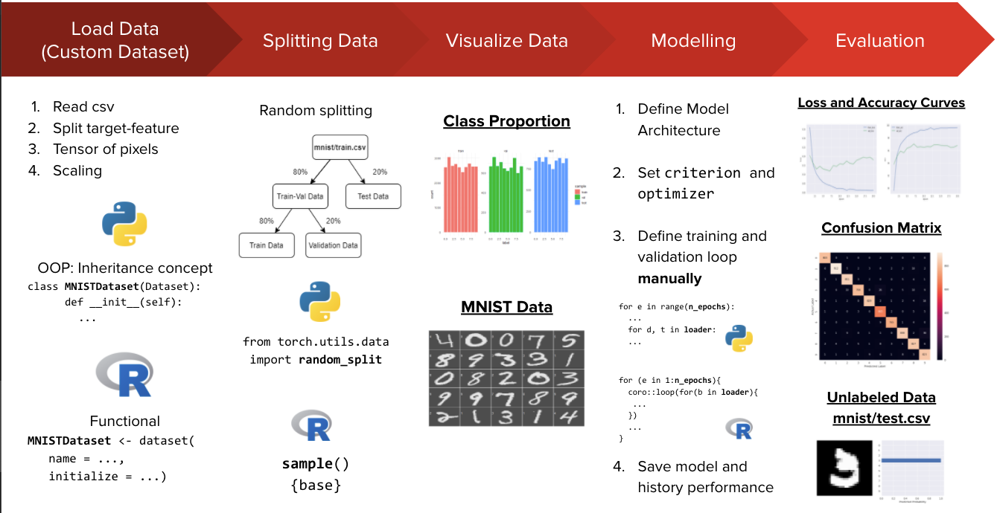

<h1 align="center">
       

Torch Handbook in Python and R

  
</h1>

# 🔍 Background

Deep learning is part of a broader family of machine learning methods based on artificial neural networks with representation learning. These neural networks attempt to simulate the behavior of the human brain allowing it to “learn” from large amounts of data. Not only possible to apply in large amounts of data, but it also allows to deal with unstructured data such as image, text, and sound.

You can try to implement a neural network from scratch. But, do you think this is a good idea when building deep learning models on a real-world dataset? It is definitely possible if you have days or weeks to spare waiting for the model to build. But, in any conditions we have many constrain to do it e.g time and cost. 

Here is the good news, now we can use deep learning frameworks that aim to simplify the implementation of complex deep learning mmodels. Using these frameworks, we can implement complex models like convolutional neural networks in no time.

A deep learning framework is a tool that allows us to build deep learning models more easily and quickly. They provide a clear and concise way for defining models using a collection of pre-built and optimized components. Instead of writing hundreds of lines of code, we can use a suitable framework to help us to build such a model quickly. 


## Keras vs Torch


|Keras | PyTorch|
|---|---|
|Keras was released in March 2015| While PyTorch was released in October 2016|
|Keras has a high level API| While PyTorch has a low level API|
|Keras is comparatively slower in speed | While PyTorch has a higher speed than Keras, suitable for high performance|
|Keras has a simple architecture, making it more readable and easy to use | While PyTorch has very low readablility due to a complex architecture|
|Keras has a smaller community support | While PyTorch has a stronger community support|
|Keras is mostly used for small datasets due to its slow speed | While PyTorch is preferred for large datasets and high performance|
|Debugging in Keras is difficult due to presence of computational junk | While debugging in PyTorch is easier and faster|
|Keras provides static computation graphs | While PyTorch provides dynamic computation graphs|
|Backend for Keras include:TensorFlow, Theano and Microsoft CNTK backend | While PyTorch has no backend implementation|

<hr>

# 🛠️ Installation

## In Python

<h2 align="center">

</h2>
<br>

Please ensure you have installed the following packages to run sample notebook. Here is the short instruction on how to create a new conda environment with those package inside it.

1. Open the terminal or Anaconda command prompt.

2. Create new conda environment by running the following command.
    ```
    conda create -n <env_name> python=3.7
    ```

3. Activate the conda environment by running the following command.
    ```
    conda activate <env_name>
    ```

4. Install additional packages such as pandas, numpy, matplotlib, seaborn, and sklearn inside the conda environment.
    ```
    pip install pandas numpy matplotlib seaborn scikit-learn
    ```
5. Install torch into the environment.
    ```
    pip3 install torch torchvision torchaudio
    ```

[For more details you can visit](https://pytorch.org/get-started/locally/)


## In R

<h2 align="center">

</h2>
<br>
Please ensure you have installed `torch` package. You also can install the following package (`dplyr`, `ggplot2`, and `tidyr`) to run sample RMarkdown. Here is the short instruction on how to install `torch` package in R.

1. Please install `torch` packages in your console
    ```
   install.packages("torch")
    ```
2. If there is a problem related to the `Rcpp` package, you can install the `Rcpp` package in your console
    ```
   install.packages("Rcpp")
    ```
[For more details you can visit](https://torch.mlverse.org/docs/articles/installation.html)

<hr>

# 📝 Problem Scope

<h2 align="center">

</h2>

We'll use famous [**MNIST Handwritten Digits Data**](https://www.kaggle.com/c/digit-recognizer/data) as our training dataset. It consists of 28 by 28 pixels grayscale images of handwritten digits (0 to 9) and labels for each image indicating which digit it represents. There are two files of data to be downloaded: `train.csv` is pixel data with actual digit label, whereas `test.csv` is pixel data **without** the actual digit label. Here are some sample image from dataset:

<h2 align="center">

</h2>

It's evident that these images are relatively small in size, and recognizing the digits can sometimes be challenging even for the human eye.

<hr>

## Work Flow

<h2 align="center">

</h2>

# 📖 Torch Handbook

This article contains an explanation of how to identify digits from a dataset of handwritten images using deep learning. Deep learning algorithm was developed within torch framework and implemented at Python and R. 

- [**Torch Handbook in Python**](https://github.com/dwiknrd/torch_handbook/tree/main/torch_in_Python)
- [**Torch Handbook in R**](https://github.com/dwiknrd/torch_handbook/tree/main/torch_in_R)

<hr>

# 👥 Contributors

- [**Dwi Gustin Nurdialit**](https://github.com/dwiknrd)
- [**Tomy Tjandra**](https://github.com/tomytjandra)
- [**Wulan Andriyani**](https://github.com/wulanandriyani)